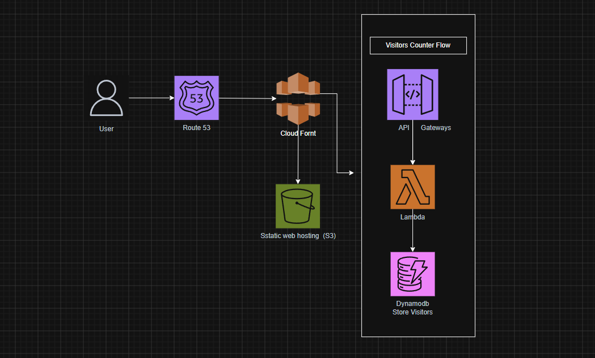
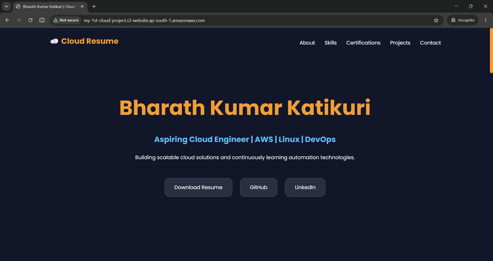
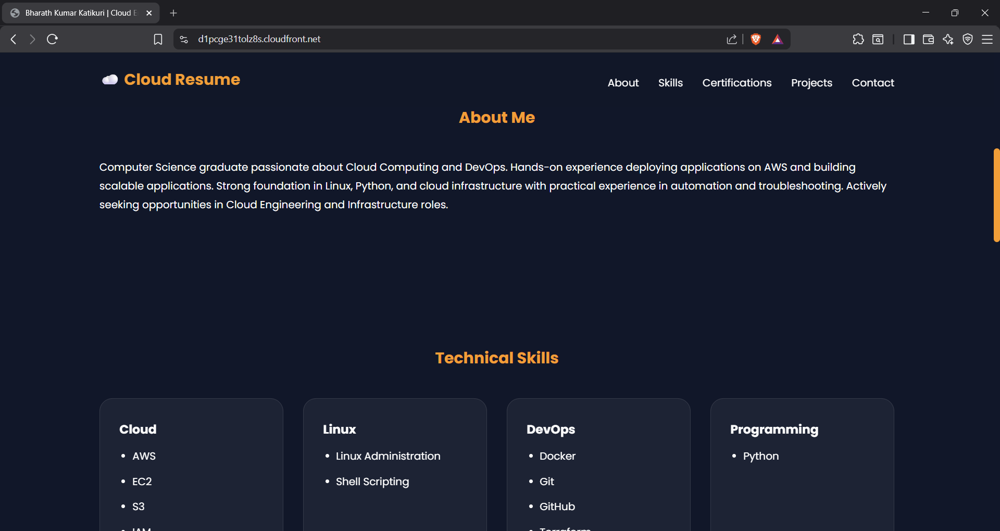
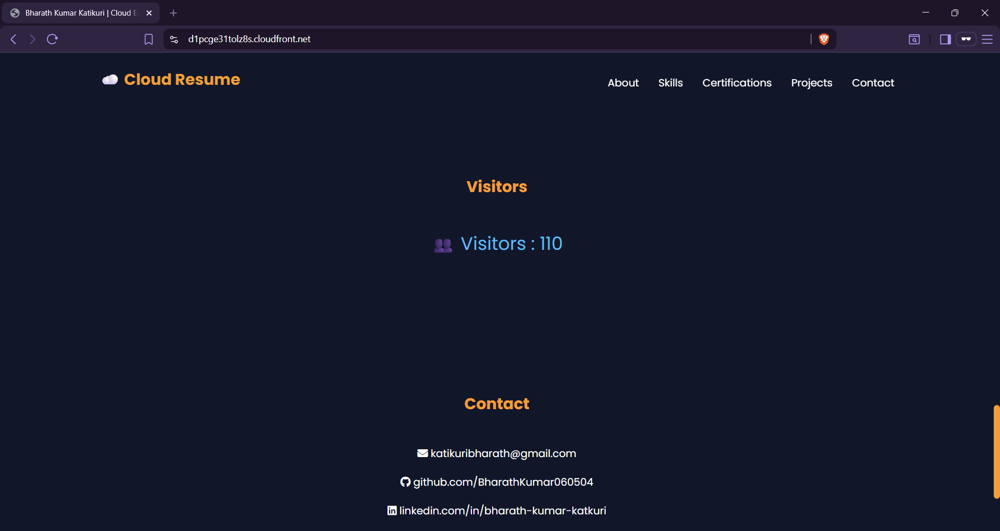
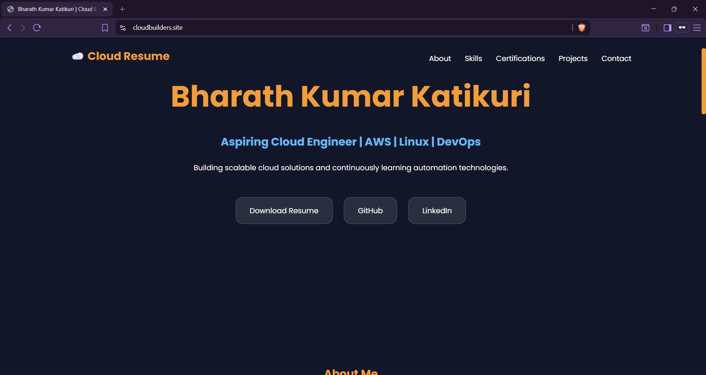

# AWS Cloud Resume Challenge
Cloud Resume Challenge built using AWS serverless services. Features a portfolio website, visitor counter, and infrastructure automation.
## Architecture


## Technologies Used

- Amazon Route 53
- Amazon CloudFront
- Amazon S3
- Amazon API Gateway
- AWS Lambda
- Amazon DynamoDB
- Git & GitHub

## Project Progress
# Step 1: Build the Portfolio Website

Designed and developed a responsive portfolio website using HTML, CSS, and JavaScript.

### Features

- Resume download
- Certificates section
- Projects section
- Responsive design

---

# Step 2: Initialize Git Repository

Create a local Git repository and connected it to GitHub.

### Commands Used

```bash
git init
git add .
git commit -m "Initial commit"
git branch -M main
git remote add origin <repository-url>
git pull origin main --allow-unrelated-histories
git push -u origin main
```

# Step 3: Configure AWS CLI Environment Variables

Configure your AWS credentials

### Commands

## Configure AWS CLI

Configure the AWS CLI by running:

```bash
aws configure
```

Enter the following information when prompted:

```text
AWS Access Key ID [None]: AKIA****************
AWS Secret Access Key [None]: ****************************************
Default region name [None]: us-east-1
Default output format [None]: json
```

This configuration allows the AWS CLI to authenticate and interact with AWS services.

# Step 4: Create S3 Bucket

Create an S3 bucket to host the portfolio website.

### Command

```bash
aws s3 mb s3://my-1st-cloud-project
```
This command creates a new S3 bucket that will be used to store the static website files.

# Step 5: Upload Website Files to S3

Upload project files to the S3 bucket.

### Command

```bash
aws s3 sync . s3://my-1st-cloud-project
```

Verify uploaded files:

```bash
aws s3 ls s3://my-1st-cloud-project
```

---

# Step 6: Enable Static Website Hosting

Configured the S3 bucket to serve the website.

### Command

```bash
aws s3 website s3://my-1st-cloud-project --index-document index.html
```

Verify configuration:

```bash
aws s3api get-bucket-website --bucket my-1st-cloud-project
```
# Step 7: Make Website Public

Disabled Block Public Access and attached a bucket policy to allow public read access.

### Bucket Policy

```json
{
  "Version": "2012-10-17",
  "Statement": [
    {
      "Sid": "PublicReadGetObject",
      "Effect": "Allow",
      "Principal": "*",
      "Action": "s3:GetObject",
      "Resource": "arn:aws:s3:::my-1st-cloud-project/*"
    }
  ]
}
```

---

# Step 8: Access Website

Website Endpoint:

```text
http://my-1st-cloud-project.s3-website.ap-south-1.amazonaws.com
```

Successfully hosted the portfolio website using Amazon S3.

## Website Preview



---

# Step 9: Create a CloudFront Distribution

Create a CloudFront distribution to improve website performance and provide HTTPS support.

## Origin Domain

```
my-1st-cloud-project.s3-website.ap-south-1.amazonaws.com
```

## Origin Protocol Policy

```
HTTP Only
```

## Default Root Object

```
index.html
```

CloudFront caches content closer to users, reducing latency and improving website performance.

## CloudFront URL

```
https://d1pcge31tolz8s.cloudfront.net
```

The website is now served securely over HTTPS through Amazon CloudFront.

### Website Preview



## Step 10: Create DynamoDB Table

Created a DynamoDB table named `visitor-counter` to store the website visitor count.

### Initial Item

| id | VisitorCount |
|----|----|
| visitors | 0 |

## Step 11: Create Lambda Function

Created a serverless backend using AWS Lambda.

### Function Details

- **Function Name:** `visitor-counter-function`
- **Runtime:** Python 3.13
- **Permissions:** `AmazonDynamoDBFullAccess`

The Lambda function increments the visitor count stored in DynamoDB and returns the updated count as a JSON response.

### Core Logic

```python
response = table.update_item(
    Key={'id': 'visitors'},
    UpdateExpression='ADD VisitorCount :inc',
    ExpressionAttributeValues={':inc': 1},
    ReturnValues='UPDATED_NEW'
)

return {
    'statusCode': 200,
    'body': json.dumps({
        'count': int(response['Attributes']['VisitorCount'])
    })
}
```

### Full Source Code

See:

```text
lambda_function.py
```

### Testing

It shows successfully invoked the function using a test event and verified that the `VisitorCount` value in DynamoDB increments correctly.


## Step 12: Create HTTP API Using API Gateway

Created an HTTP API and integrated it with the Lambda function.

### Route

```text
GET /visitor
```

Example response:

```json
{
  "count": 5
}
```

### Step 13: Frontend Integration

Updated script.js to fetch data from API Gateway.

async function loadVisitorCount() {

    try {

        const response = await fetch(
            "https://<api-id>.execute-api.ap-south-1.amazonaws.com/visitor"
        );

        const data = await response.json();

        document.getElementById("visitor-count").innerHTML = data.count;

    }

    catch (error) {

        document.getElementById("visitor-count").innerHTML = "Unavailable";

    }

}

loadVisitorCount();


## Step 14: Implement Dynamic Visitor Counter

Updated `script.js` to fetch the visitor count from API Gateway and display it dynamically on the website.

### Screenshot



---

## Step 15: Deploy Updated Files to Amazon S3

Synced the local project files to the S3 bucket:

```bash
aws s3 sync . s3://my-1st-cloud-project --delete
```

This uploaded the latest changes to the production bucket.

---

## Step 16: Invalidate CloudFront Cache

Created a CloudFront invalidation to ensure users receive the latest version of the website.

```bash
aws cloudfront create-invalidation --distribution-id <DISTRIBUTION_ID> --paths "/*"
```

### Step 17: Create Route 53 Hosted Zone

Created a public hosted zone for the custom domain.

Navigate to:
Route 53
→ Hosted Zones
→ Create Hosted Zone
Configuration
  Domain Name: cloudbuilders.site
Type: Public Hosted Zone

AWS automatically created:

NS Record
SOA Record
### Step 18: Update GoDaddy Nameservers

Copied the nameservers generated by Route 53 and replaced the default GoDaddy nameservers.

Navigate to:
GoDaddy
→ Domain Settings
→ DNS
→ Nameservers
→ Change Nameservers
Replace
ns53.domaincontrol.com
ns54.domaincontrol.com
With
ns-xxxx.awsdns-xx.com
ns-xxxx.awsdns-xx.net
ns-xxxx.awsdns-xx.org
ns-xxxx.awsdns-xx.co.uk
### Step 19: Request SSL Certificate

CloudFront requires certificates to be created in the us-east-1 region.

Navigate to:
AWS Certificate Manager
→ us-east-1
→ Request Certificate
Domain Names
cloudbuilders.site
*.cloudbuilders.site
Validation Method
DNS Validation
### Step 20: Create DNS Validation Records

Created DNS validation records automatically in Route 53.

Navigate to:
Certificate Manager
→ Select Certificate
→ Create Records in Route 53
CNAME Record
_xxxxx.cloudbuilders.site
        ↓
_xxxxx.acm-validations.aws
Certificate Status
Pending Validation
        ↓
Issued
### Step 21: Configure CloudFront Custom Domain
Navigate to:
CloudFront
→ Distributions
→ Edit
Alternate Domain Names
cloudbuilders.site
Default Root Object
index.html
Custom SSL Certificate

Selected:

cloudbuilders.site
### Step 22: Create Route 53 Alias Record
Navigate to:
Route 53
→ Hosted Zone
→ Create Record
Configuration
Record Type: A
Alias: Yes
Route Traffic To: CloudFront Distribution
### Step 23: Verify Custom Domain

Opened:

https://cloudbuilders.site
Verified
✅ HTTPS enabled
✅ CloudFront working
✅ Route 53 configured
✅ Visitor counter functioning properly

### Website Accessible Through Custom Domain



